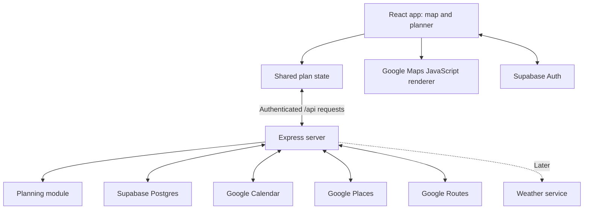
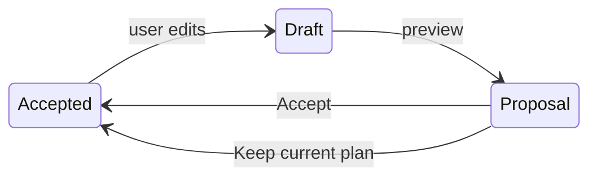

# DayMap architecture

**Status:** initial implementation, September 2026. The React frontend now has a shared sample day and selection demo (issue #5). Backend, live integrations, map rendering, and the remaining architecture are proposed. Current run commands and the selection interface are in [client/README.md](client/README.md). Who builds what, and when, is in [CONTRIBUTING.md](CONTRIBUTING.md).

This is the technical source of truth. Changing the data contract (§5), the API (§6), or the security rules (§7, §8, §10) needs team agreement. When an [open decision](#12-open-decisions) is resolved, record it in the relevant section and remove it from §12.

## Contents

1. [Product scope](#1-product-scope)
2. [System overview](#2-system-overview)
3. [Repository layout](#3-repository-layout)
4. [Frontend](#4-frontend)
5. [Shared data contract](#5-shared-data-contract)
6. [Backend API](#6-backend-api)
7. [Database and access control](#7-database-and-access-control)
8. [Google Calendar integration](#8-google-calendar-integration)
9. [Routing and scheduling](#9-routing-and-scheduling)
10. [Configuration and deployment](#10-configuration-and-deployment)
11. [Verification](#11-verification)
12. [Open decisions](#12-open-decisions)

## 1. Product scope

DayMap is a web app that shows a user's day on a real geographic map with a linked event planner. Calendar commitments, manually added activities, and travel times form one plan. Later, weather and transport changes can produce understandable suggestions.

### MVP boundaries

| Dimension | First scope |
| --- | --- |
| Area | Adelaide |
| Time span | One day |
| Calendar | The user's primary Google Calendar, read-only |
| Transport | One mode, chosen at kickoff |
| Scheduling | Keeps the user's order and flags conflicts ([§9](#9-routing-and-scheduling)). Never promise globally optimal scheduling. |

### Core flow

Milestones A to C build up to this flow:

1. Load the day's stops.
2. Select a stop on either the map or the planner, and the other surface follows.
3. Import Calendar events.
4. Confirm locations for events that lack one.
5. Calculate journeys between located stops.
6. Preview one schedule adjustment, then accept it or keep the current plan.

### Not in the MVP

- **Later backlog**, once milestones A to C work: weather, direct Adelaide Metro/GTFS feeds and forecasting, morning plan generation, background jobs and Calendar webhooks, notifications, a calendar picker, mixed transport modes, drag-to-reorder, camera tours.
- **Deferred:** AI features, multi-day optimisation, team calendars, automatic Calendar edits (any write-back), offline navigation, microservices.

The first product should demonstrate one coherent day and one understandable adjustment.

## 2. System overview

### Stack

| Layer | Choice | Responsibility |
| --- | --- | --- |
| Client | React, JavaScript/JSX, Vite; CSS or Tailwind (chosen in DM-01) | UI, map lifecycle, local editing, selection |
| Client state | React context + reducer (`PlanProvider`) | One accepted plan, draft/proposal, selected stop, UI state |
| Server | Node.js + Express, JavaScript ES modules | Session checks, validation, integrations, plan calculation and persistence |
| Database | Supabase PostgreSQL | Per-user preferences and versioned day plans |
| Identity | Supabase Auth | DayMap sign-in and sessions |
| Map display | Google Maps JavaScript API, photorealistic 3D, with a 2D fallback | Terrain and buildings, markers, route polylines |
| External data | Google Calendar, Places, Routes; weather later | Events, places, travel estimates, forecasts |
| Tooling | npm workspaces (`client`, `server`), one lockfile, Node LTS pinned in `.nvmrc` | Reproducible installs |

The codebase is JavaScript only. Use JSDoc where it clarifies shared shapes. TypeScript is not part of the initial stack.

### Components



### Boundaries

| From | To | Rule |
| --- | --- | --- |
| Browser | Supabase | **Auth only.** All app data reads and writes go through the Express `/api`. |
| Browser | Google Maps JavaScript API | The map renderer and Places autocomplete/preview load directly in the browser, using a website- and API-restricted browser key. |
| Server | Google Calendar, Routes | The server calls these providers and normalises their responses. Places autocomplete/preview is the browser exception approved by Rafid for issue #16. Google-specific Places objects stay inside the client service adapter. |
| Frontend services | Demo or live data | Both modes sit behind the same service interface ([§4](#demo-and-live-modes)). |

## 3. Repository layout

```text
client/src/
  app/                  # App shell and PlanProvider (Rafid coordinates)
  map/                  # Map adapter, markers, route overlays (Rafid)
  planner/              # Cards, editing, questions, proposals (Hannah)
  components/           # Shared UI primitives (Hannah coordinates)
  services/             # Express API and Supabase Auth clients
server/src/
  routes/               # Express handlers and validation (Sudipta)
  middleware/           # Authentication and error handling (Sudipta)
  integrations/         # Calendar, Places, Routes, later weather (Rafid)
  planning/             # Scheduling and conflict/proposal calculation (Sudipta)
  repositories/         # Database access and secure token storage (Sudipta)
shared/
  fixtures/             # Fictional Adelaide demo plan
  contracts/            # JSDoc shapes and agreed validation rules
supabase/migrations/    # Versioned SQL schema and access policies (Sudipta)
```

**Integration split.** Rafid owns the provider adapters in `server/src/integrations/`: provider requests and response normalisation. Sudipta owns everything that exposes them to the app: authenticated endpoints, session binding, secure token storage, database writes, and the planning engine. They agree on each adapter's inputs and outputs before implementing it.

- npm workspaces for `client` and `server`, one committed lockfile, one agreed Node LTS version. Exact dependency versions are pinned during scaffolding (DM-01).
- `shared/contracts/` and `shared/fixtures/` are agreed by the whole team. Fixtures contain fictional Adelaide data only.
- The schema changes only through `supabase/migrations/` ([§7](#7-database-and-access-control)).

Area owners are listed in [CONTRIBUTING.md §1](CONTRIBUTING.md#1-team-and-ownership).

## 4. Frontend

### UI surfaces

Based on the initial sketch:

| Surface | Behaviour | Owner |
| --- | --- | --- |
| Full-screen map | Photorealistic 3D where supported; stop markers and actual route geometry | Rafid |
| Top location search | Finds geographic places; choosing one opens a location popover with **Add event** | Rafid (integration), Hannah (styling) |
| Top-left menu | Account, Calendar connection, preferences | Hannah |
| Right floating Events panel | Chronological cards, event filter, add/edit controls, travel summaries | Hannah |
| Place/event popover | Details of the selected place or activity; links map selection with planner selection | Shared |
| Left vertical rail | Purpose not labelled in the sketch. Leave it out until the team agrees on one. | Team decision |

### Layout and interaction

- **Two different searches.** The top search finds *places*. The panel filter searches *existing events*. Searching never silently adds an activity: a confirmed **Add event** supplies a duration and either a fixed time or a flexible window.
- **Panel.** Roughly 360px wide on desktop, with a collapse control. A bottom sheet on mobile.
- **Map space.** Leave room for map attribution and controls. Don't open large popovers for every stop at once.
- **Accessibility.** Every card shows readable times. Every map interaction has a keyboard-accessible alternative.
- **Camera.** Selecting a stop may focus the camera on it. Background schedule updates must never move the camera. Camera tours are later work.

### Plan state

`PlanProvider` owns the accepted plan, the current draft or proposal, and the selected stop. Components dispatch actions (select, edit, add, remove) and never keep their own copy of the plan. Planner filters and the map camera position are UI state.



- An explicit edit creates a draft. Edits that change timing mark the affected legs stale until they are recalculated.
- Preview returns routes, conflicts, and a proposal without touching the accepted plan.
- **Accept** replaces the accepted plan only if the proposal's base version still matches; otherwise the server returns 409. **Keep current plan** leaves the accepted plan unchanged.
- Recalculation (DM-08) reuses this flow. There is no separate route editor.

### Browser place search (issue #16)

Rafid approved browser Places autocomplete and selected-place details so search can work before the backend is merged. `client/src/services/places.js` owns session tokens and Google prediction objects, returning plain place data. Suggestions are biased toward Adelaide and restricted to Australia. The selected preview lives in App UI state, separate from the accepted plan; it never creates an activity. Requests are debounced and late results ignored. The planned server Places endpoints below are deferred for this flow; Calendar, Routes, and persistence retain their server boundaries.

Enable Places API (New) and Maps JavaScript API for the restricted browser key. Results are transient, not persisted.

### `MapView` adapter

The map sits behind a single adapter:

```jsx
<MapView stops={stops} legs={legs} selectedStopId={selectedStopId} onSelectStop={selectStop} />
```

- The adapter holds no planning logic and renders what it is given. The same inputs can drive a 2D fallback.
- One map instance stays mounted while panels and data change.
- Stops without a location are left off the map but stay in the planner.

### Demo and live modes

- Demo mode must keep working without login or Calendar credentials. Issue #5 imports `shared/fixtures/demoPlan.js` directly so the frontend runs before the backend exists. Once DM-04 is implemented, the demo service will read the same fixture through `GET /api/demo-plan`, which makes no external API calls.
- Simulated data, including sample route geometry and disruptions, is clearly labelled in the UI (`dataMode: 'demo'`).

## 5. Shared data contract

The contract lives in `shared/contracts/` (JSDoc shapes and validation rules) and `shared/fixtures/`. Field names, units, and enums change only with whole-team agreement.

### Conventions

| Topic | Rule |
| --- | --- |
| IDs | Stable strings. Production record IDs are UUIDs. |
| Timestamps | Stored in UTC, with an IANA timezone (e.g. `Australia/Adelaide`) for day boundaries and display. **Never hard-code Adelaide's UTC offset**, because daylight saving changes it. |
| Coordinates | Named `lat`/`lng` properties, never arrays. |
| Durations | Route durations in **seconds**. User-entered visit durations in **minutes**, with explicit names such as `durationMinutes`. |
| Fixed events | Keep their original start and end. |
| All-day items | Stay visible and are never given a made-up arrival time. |
| Missing location | `location: null` plus a planner question. Travel to or from the stop is *unknown*, never zero. |

### `dayPlan` shape

```js
// Abbreviated shape; the shared fixture should contain several stops and legs.
const dayPlan = {
  id: 'demo-plan',
  date: '2026-09-26',
  timezone: 'Australia/Adelaide',
  version: 1,
  dataMode: 'demo', // 'demo' | 'live'
  stops: [{
    id: 'stop-1',
    title: 'Library study',
    source: 'manual', // 'manual' | 'google-calendar'
    sourceEventId: null,
    sourceCalendarId: null,
    location: {
      label: 'Confirmed library location',
      placeId: null,
      lat: -34.9206,
      lng: 138.6062
    }, // null when unresolved or not a physical destination
    timing: {
      kind: 'flexible', // 'fixed' | 'flexible' | 'all-day'
      durationMinutes: 60,
      fixedStartAt: null,
      fixedEndAt: null,
      earliestStartAt: null,
      latestEndAt: null,
      scheduledStartAt: null,
      scheduledEndAt: null
    },
    status: 'planned' // 'planned' | 'completed' | 'skipped'
  }],
  legs: [],
  conflicts: [],
  questions: []
};
```

### Related objects

§5 defines what each object must contain. The exact field names are set in DM-01 ([§12](#12-open-decisions)).

| Object | Required content |
| --- | --- |
| Journey leg | `id`, `fromStopId`, `toStopId`, mode, departure and arrival, duration in seconds, route coordinates, provider, fetched time, status |
| Conflict | Stable ID, affected stop IDs, reason code, plain-language explanation |
| Question | Stop ID, missing field, prompt, status. Skipping a question must not invent a location. |
| Proposal | ID, plan ID, base version, proposed stops and legs, explanation, remaining conflicts |

### Enums

| Field | Values |
| --- | --- |
| `dataMode` | `demo`, `live` |
| `stops[].source` | `manual`, `google-calendar` |
| `stops[].timing.kind` | `fixed`, `flexible`, `all-day` |
| `stops[].status` | `planned`, `completed`, `skipped` |
| Leg status | `ready`, `unavailable`, `stale` |
| Question status | `unanswered`, `deferred`, `answered` |

## 6. Backend API

### Rules

- `GET /api/health` and `GET /api/demo-plan` are public. Every user-data endpoint requires a verified Supabase session. The Calendar callback is validated by its one-time state.
- The server takes the user ID from the verified session, **never** from a request-body `userId`.
- Errors share one shape and use a meaningful status code, for example 401 for an expired session and 409 for a stale version:

  ```json
  { "error": { "code": "...", "message": "...", "retryable": false } }
  ```

- Provider failures never erase a saved plan. The last accepted plan stays visible, and stale travel estimates are shown as stale.
- The health endpoint exposes no secrets.

### Endpoints

These endpoints are proposed, starting with DM-04.

| Endpoint | Purpose | Issue |
| --- | --- | --- |
| `GET /api/health` | Basic health | DM-04 |
| `GET /api/demo-plan` | Fictional fixture, no external API calls | DM-04 |
| `GET /api/plans?date=YYYY-MM-DD&timezone=...` | Read the signed-in user's plan for a day | DM-04 |
| `PUT /api/plans/:id` | Validate and save a plan, checking `baseVersion` | DM-04 |
| `POST /api/plans/:id/preview` | Validate an edited draft and return routes, conflicts, and a proposal without changing the accepted plan | DM-07/DM-08 ([§12](#12-open-decisions)) |
| `POST /api/plans/:id/accept` | Accept a server-held proposal if its base version still matches | DM-08 |
| `POST /api/calendar/connect` | Create a Google authorisation URL with one-time state bound to the user | DM-06 |
| `GET /api/calendar/callback` | Validate the state and complete the server-side code exchange | DM-06 |
| `POST /api/calendar/import` | Import the chosen day from the primary calendar | DM-06 |
| `POST /api/calendar/disconnect` | Revoke access where possible and delete stored Google credentials | DM-06 |
| `GET /api/places/search?q=...` | Find candidate places (the client debounces requests) | DM-07 |
| `GET /api/places/:id` | Resolve a chosen place's coordinates and details | DM-07 |

## 7. Database and access control

### Tables

| Table | Contents |
| --- | --- |
| `profiles` | Timezone and preferences |
| `day_plans` | Owner, date, timezone, version, plan (JSONB) |
| `plan_proposals` | Owner, plan, base version, candidate plan, status |
| Calendar credentials (server-only schema) | User ID, granted scopes, encrypted Google refresh token |

A single JSONB plan keeps the first model small. Split stops and legs into their own tables later, and only if querying needs justify it.

### Access rules

- Enable row-level security (RLS) on every user-facing table, with policies tied to `auth.uid()`.
- Use the caller's verified token for ordinary database access so those policies apply.
- The Supabase secret (service-role) key bypasses RLS. Use it only for narrowly scoped privileged operations, and verify ownership explicitly every time.
- Keep Calendar credentials in a server-only table or schema, outside public Data API access.
- Saving a plan and accepting a proposal each run an atomic check against `baseVersion`. A mismatch returns 409.

### Migrations

- Every schema change, including access policies, is a versioned migration in `supabase/migrations/`. No undocumented dashboard edits. Sudipta owns migrations.
- Migrations ship with access-isolation tests that prove one user cannot read or change another user's plans.
- The team starts with one shared development Supabase project.

## 8. Google Calendar integration

### Sign-in vs Calendar access

Supabase Auth signs users into DayMap. A separate **Connect Google Calendar** flow grants Calendar access. A Supabase login token is not a Google Calendar token, and Supabase does not refresh Google provider tokens for the app.

### Connection flow

1. `POST /api/calendar/connect`: the server creates one-time state bound to the user's session and returns a Google authorisation URL.
2. The user consents to `calendar.events.readonly`, with offline access where refresh is needed. Calendar-list permission is added only if a calendar picker is built (later backlog).
3. `GET /api/calendar/callback`: the server validates the state and completes the authorisation-code exchange server-side.
4. The server encrypts the refresh token with `TOKEN_ENCRYPTION_KEY` and stores it with the user ID and the granted scopes.

Token rules:

- Never return tokens in API responses or write them to logs.
- Never overwrite an existing refresh token with an absent one.
- Handle denial, revocation, a missing refresh token, and reconnection explicitly. Denied or expired access prompts the user to reconnect.
- Disconnecting revokes access where possible and deletes the stored credentials.

### Import rules

- Primary calendar only.
- Convert the local day's boundaries, in the user's timezone, to timestamps for the query.
- Expand recurring events into occurrences, and follow pagination.
- Deduplicate by calendar ID plus event/occurrence ID (`sourceCalendarId` + `sourceEventId`), so repeated imports create no duplicates.
- Handle cancellations, date-only all-day events, virtual meetings, and missing or ambiguous addresses.
- A missing location becomes a planner question, never a guessed map pin.
- Import is read-only. DayMap never writes to Google Calendar.

## 9. Routing and scheduling

Map rendering and route calculation use separate APIs. Draw the route geometry that Routes returns: straight lines between pins are not journeys.

### Scheduling rules

For each candidate plan:

1. Preserve completed activities and fixed commitments.
2. Place flexible activities in the order the user gave. Do not start with a general route optimiser.
3. Calculate travel between successive physical stops at the relevant departure times.
4. Include each activity's duration and the user's transition buffer.
5. Flag missed time windows and fixed-event conflicts. An unresolved location makes the affected travel unknown, not zero.
6. Return a proposal with explicit changes and reasons. Never silently move a fixed event.

### Journey requests

- Request each journey separately, because Google transit routes do not support intermediate waypoints.
- Use each journey's actual departure time. Later departures depend on earlier travel and visit durations, so requests cannot all assume the same start time.
- If mixed transport modes are added later, keep the user's car location consistent.

### Stale responses and provider terms

- Abort superseded client requests, and tag requests with draft/version IDs so late responses cannot overwrite newer edits.
- Debounce edits and bound retries.
- Reuse provider responses only where the provider's terms allow it. Don't treat Google map imagery, place content, or route geometry as a permanent cache: confirm the retention rules before persisting provider fields ([§12](#12-open-decisions)), and refetch when required.

### Weather (later)

Weather first annotates relevant times and stops. Turning rain into schedule changes needs explicit rules and user preferences. Direct GTFS integration and forecasting are later work, not dependencies of milestones A to C.

## 10. Configuration and deployment

### Environment variables

| Variable | Side | Purpose |
| --- | --- | --- |
| `VITE_API_BASE_URL` | Client | Express API base URL |
| `VITE_SUPABASE_URL` | Client | Supabase project URL for Auth |
| `VITE_SUPABASE_PUBLISHABLE_KEY` | Client | Supabase publishable key for Auth |
| `VITE_GOOGLE_MAPS_API_KEY` | Client | Browser map renderer; restricted by website and API |
| `PORT` | Server | Express port (3001 locally) |
| `CLIENT_ORIGIN` | Server | Exact allowed frontend origin |
| `SUPABASE_URL` | Server | Supabase project URL |
| `SUPABASE_PUBLISHABLE_KEY` | Server | Session verification and user-scoped database access |
| `SUPABASE_SECRET_KEY` | Server | Privileged operations only; bypasses RLS |
| `GOOGLE_MAPS_SERVER_KEY` | Server | Places and Routes requests |
| `GOOGLE_OAUTH_CLIENT_ID` | Server | Calendar authorisation-code flow |
| `GOOGLE_OAUTH_CLIENT_SECRET` | Server | Calendar authorisation-code flow |
| `GOOGLE_OAUTH_REDIRECT_URI` | Server | Exact Calendar callback URL |
| `TOKEN_ENCRYPTION_KEY` | Server | Encrypts stored Google refresh tokens |

- Anything prefixed `VITE_` is visible in the browser. Only the four client variables above belong there. Server secrets never get a `VITE_` prefix.
- Add every new variable to the matching `client/.env.example` or `server/.env.example` as a placeholder. Real values live in git-ignored local files (`client/.env.local`, `server/.env`) and in deployment settings, and are shared privately.
- The Supabase publishable key and the browser Maps key are designed for client use with access policies and restrictions. Server credentials are not. Restrict the browser Maps key by allowed websites and APIs. Give the server its own Maps key, with API restrictions and deployment-appropriate application restrictions.

### Hosting

- Serve the Vite build from a static host and Express from a Node-capable host. The hosts are still to be chosen ([§12](#12-open-decisions)).
- Use HTTPS, exact allowed frontend origins, and exact OAuth callback URLs. Register localhost separately for development.
- Local development: client on port 5173, server on 3001, with Vite proxying `/api` to the server.

### Background work

The MVP recalculates on user actions and on explicit refresh while the app is open. A normal web page cannot guarantee background polling after it is closed. Morning plan generation, Calendar webhooks, scheduled jobs, and push notifications need a later server worker/scheduler design.

## 11. Verification

### On the demo laptop, early

Check 3D coverage at the demo locations, graphics support, marker readability, route visibility, and panel overlap. When 3D cannot load, show 2D or a clear retry/fallback experience.

### Behaviour checks

- Map and card selection stay in sync.
- Missing locations remain editable.
- Two users cannot access each other's plans.
- Recurring imports do not create duplicates.
- Fixed times survive recalculation.
- Failed API calls preserve the last accepted plan.
- Stale proposals cannot be accepted.
- Demo mode works without login or Calendar credentials.

### Tests

Write focused automated tests for scheduling calculations, Calendar normalisation, stale-response handling, and access rules. Check the interface visually. Don't write tests that only mirror styling code.

## 12. Open decisions

Resolve each one by the point shown, record the outcome in the relevant section, and delete the row.

| Decision | Decide by | Notes |
| --- | --- | --- |
| Transport mode for the MVP | Kickoff | One mode only ([§1](#1-product-scope)) |
| Node LTS version | Kickoff / DM-01 | Pinned in `.nvmrc` |
| CSS or Tailwind | DM-01 | |
| Linter and formatter | DM-01 | Backs the root `lint` script |
| Field names for legs, conflicts, questions, and proposals | DM-01 | §5 defines only their required content |
| Test framework | First planning or access-control tests | Backs the root `test` script |
| How DM-07 gets route geometry | Before DM-07 starts | The only endpoint that returns routes today is `POST /api/plans/:id/preview`, which is otherwise DM-08 scope |
| Whether place search requires sign-in | Before DM-07 starts | Affects demo mode and server key usage |
| Which provider fields saved plans may persist | Before legs or place details are saved | Google retention rules; route geometry is part of each leg |
| Frontend and backend hosts | Before the connected demo | Must not block Milestone A. Record origins and OAuth redirects in the setup docs. |
| Purpose of the left vertical rail | Team decision | Leave it out until agreed |

## References

- [Google 3D Maps overview](https://developers.google.com/maps/documentation/javascript/3d/overview) and [coverage](https://developers.google.com/maps/documentation/javascript/3d/coverage).
- [Google transit route capabilities](https://developers.google.com/maps/documentation/routes/transit-route).
- [Calendar events listing](https://developers.google.com/workspace/calendar/api/v3/reference/events/list) and [permission scopes](https://developers.google.com/workspace/calendar/api/auth).
- [Google web-server OAuth](https://developers.google.com/identity/protocols/oauth2/web-server) and [Maps key security](https://developers.google.com/maps/api-security-best-practices).
- [Supabase database](https://supabase.com/docs/guides/database/overview), [Auth](https://supabase.com/docs/guides/auth), and [provider-token responsibilities](https://supabase.com/docs/guides/auth/social-login).
