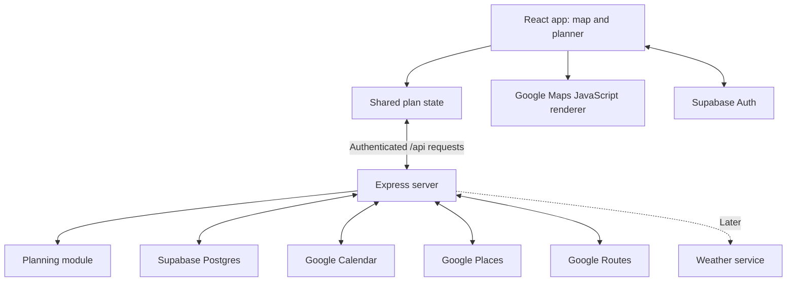

# DayMap architecture

**Status:** proposed initial architecture, September 2026. This document describes what we will build; no application implementation exists yet. Team assignments and starter issues are in [CONTRIBUTING.md](CONTRIBUTING.md).

## 1. Product and first scope

DayMap is a web app showing a user's day on an actual geographic map, with a linked event planner. Calendar commitments, manually added activities, and travel times form one plan. Later, weather and transport changes can produce understandable suggestions.

The initial complete flow is: load stops, select them on either surface, import Calendar events, confirm locations, calculate journeys, and preview one schedule adjustment. Start with Adelaide, a single day, the user's primary Google calendar, and one transport mode chosen at kickoff. Do not promise globally optimal scheduling.

## 2. UI based on the initial sketch

| Surface | Behaviour | Owner |
| --- | --- | --- |
| Full-screen map | Photorealistic 3D where supported; stop markers and actual route geometry | Rafid |
| Top location search | Finds geographic places; selection opens a location popover with Add event | Rafid integration; Hannah styling |
| Top-left menu | Opens account, Calendar connection, and preferences | Hannah |
| Right floating Events panel | Chronological cards, event filter, add/edit controls, and travel summaries | Hannah |
| Place/event popover | Shows selected place or activity details; connects map selection with planner selection | Shared |
| Left vertical rail | Reserved: its purpose is not labelled in the sketch; leave it out of the first milestone until agreed | Team decision |

The top search finds **places**; the panel search filters **existing events**. Searching does not silently add an activity. A confirmed Add event action supplies a duration and fixed time or flexible window.

Use roughly a 360px-wide panel on desktop, with a collapse control. On mobile, use a bottom sheet. Leave space for map attribution and controls. Avoid showing large popovers for every stop at once. All cards have readable times and a keyboard-accessible alternative to map interaction.

Selection can focus a destination, but background schedule updates must not unexpectedly move the camera. A camera tour is a later enhancement. Keep the map instance mounted while panels and data change.

## 3. Stack and boundaries

| Layer | Initial choice | Responsibility |
| --- | --- | --- |
| Client | React, JavaScript/JSX, Vite, CSS or Tailwind chosen in DM-01 | UI, map lifecycle, local editing, selection |
| State | React context + reducer | One accepted plan, draft/proposal, selected stop, UI state |
| Server | Node.js + Express, JavaScript ES modules | Authentication checks, validation, integrations, plan calculation and persistence |
| Database | Supabase PostgreSQL | Per-user preferences and versioned day plans |
| Identity | Supabase Auth | DayMap sign-in and sessions |
| Map display | Google Maps JavaScript 3D | Terrain/buildings, markers, geographic polylines |
| External data | Google Calendar, Places, Routes; weather later | Calendar events, places, travel estimates, forecast data |



App data reads/writes go through Express initially; the browser uses Supabase directly for Auth only. The map renderer loads directly in the browser. Google service responses are normalised on the server, so frontend components do not depend on provider-specific event or route shapes.

Use a `MapView` adapter with inputs `stops`, `legs`, `selectedStopId` and callback `onSelectStop`. Keep planning logic out of that adapter. This also leaves room for a 2D fallback using the same data.

## 4. Proposed repository layout

```text
client/src/
  app/                  # App shell and PlanProvider (Rafid coordinates)
  map/                  # Map adapter, markers, route overlays (Rafid)
  planner/              # Cards, editing, questions, proposals (Hannah)
  components/           # Shared UI primitives (Hannah coordinates)
  services/             # Express API and Supabase Auth clients
server/src/
  routes/               # Express handlers and validation
  middleware/           # Authentication and error handling
  integrations/         # Calendar, Places, Routes, later weather
  planning/             # Scheduling and conflict/proposal calculation
  repositories/         # Database access
shared/
  fixtures/             # Fictional Adelaide demo plan
  contracts/            # JSDoc shapes and agreed validation rules
supabase/migrations/    # Versioned SQL schema and access policies
```

Use npm workspaces for `client` and `server`, one lockfile, and one agreed Node LTS version. Exact dependency versions are pinned when scaffolding. Keep fixture mode and live mode behind the same frontend service interface.

## 5. Shared data contract

All IDs are stable strings; production record IDs are UUIDs. Store timestamps in UTC and keep an IANA timezone such as `Australia/Adelaide` for day boundaries and display. Never hard-code Adelaide's UTC offset: daylight saving changes it.

```js
// Abbreviated shape; the shared fixture should contain several stops and legs.
const dayPlan = {
  id: 'demo-plan',
  date: '2026-09-26',
  timezone: 'Australia/Adelaide',
  version: 1,
  dataMode: 'demo', // 'demo' | 'live'
  stops: [{
    id: 'stop-1',
    title: 'Library study',
    source: 'manual', // 'manual' | 'google-calendar'
    sourceEventId: null,
    sourceCalendarId: null,
    location: {
      label: 'Confirmed library location',
      placeId: null,
      lat: -34.9206,
      lng: 138.6062
    }, // null when unresolved or not a physical destination
    timing: {
      kind: 'flexible', // 'fixed' | 'flexible' | 'all-day'
      durationMinutes: 60,
      fixedStartAt: null,
      fixedEndAt: null,
      earliestStartAt: null,
      latestEndAt: null,
      scheduledStartAt: null,
      scheduledEndAt: null
    },
    status: 'planned' // 'planned' | 'completed' | 'skipped'
  }],
  legs: [],
  conflicts: [],
  questions: []
};
```

| Object | Required meaning |
| --- | --- |
| Journey leg | `id`, `fromStopId`, `toStopId`, mode, departure/arrival, duration in seconds, coordinates for the route, provider, fetched time, and status (`ready`, `unavailable`, `stale`) |
| Conflict | Stable ID, affected stop IDs, reason code, and plain-language explanation |
| Question | Stop ID, missing field, prompt, and status (`unanswered`, `deferred`, `answered`); skipping must not invent a location |
| Proposal | ID, plan ID, base version, proposed stops/legs, explanation, and remaining conflicts |

Route durations use seconds; user-entered visit durations use minutes with explicit field names. Geo coordinates use named `lat`/`lng` properties, avoiding array-order confusion. Fixed events keep their original start/end; all-day items stay visible without being assigned a made-up arrival time.

One provider owns the accepted plan and selected stop. Planner filters and map camera state are UI state, not separate copies of the plan. Components dispatch actions such as select, edit, add, and remove. An explicit edit creates a draft; changes affecting timing invalidate affected legs until recalculated. A proposal stays separate until accepted.

## 6. Proposed backend contract

All user-data endpoints require a verified Supabase session. The server derives the user ID from that session, never from a trusted request-body `userId`. These are proposed endpoints for DM-04 onward.

| Endpoint | Purpose |
| --- | --- |
| `GET /api/health` | Basic health, without secrets |
| `GET /api/demo-plan` | Public fictional fixture, no external API calls |
| `GET /api/plans?date=YYYY-MM-DD&timezone=...` | Read the signed-in user's plan |
| `PUT /api/plans/:id` | Validate and save a plan, checking `baseVersion` |
| `POST /api/calendar/connect` | Generate Google authorisation URL with state bound to the signed-in user |
| `GET /api/calendar/callback` | Validate one-time OAuth state and complete server-side code exchange |
| `POST /api/calendar/import` | Import the chosen day from the primary calendar |
| `POST /api/calendar/disconnect` | Revoke the connection where possible and remove stored Google credentials |
| `GET /api/places/search?q=...` | Find candidate places; debounce client requests |
| `GET /api/places/:id` | Resolve a chosen place's coordinates/details |
| `POST /api/plans/:id/preview` | Validate an edited draft and return routes, conflicts, and a proposal without changing the accepted plan |
| `POST /api/plans/:id/accept` | Accept a server-held proposal if its base version still matches |

Errors use `{ error: { code, message, retryable } }`; return useful status codes such as 401 for expired sessions and 409 for stale versions. Provider failures must not erase saved plans. Show stale travel estimates as stale. Reuse the draft/preview flow for the first recalculation; avoid adding a separate route editor.

## 7. Supabase and Google Calendar

Start with tables for `profiles` (timezone and preferences), `day_plans` (owner, date, timezone, version, plan JSONB), and `plan_proposals` (owner, plan, base version, candidate, status). A JSONB plan keeps the initial model small; separate stops/legs into tables later only if querying needs justify it. Use an atomic version check when saving or accepting a proposal.

Enable row-level security on user-facing tables with policies tied to `auth.uid()`. Use the caller's verified token for ordinary database access so those policies apply. A Supabase server secret/service-role key bypasses RLS: any narrowly scoped use must explicitly verify ownership.

Store Calendar credentials in a server-only table/schema, outside public Data API access. Encrypt Google refresh tokens using a server-held key; do not return them in plan responses or logs. Keep user IDs and granted scopes alongside the encrypted token. Migrations and access-isolation tests belong with this work.

For the MVP, Supabase Auth handles app sign-in; a separate **Connect Google Calendar** flow grants Calendar access. A Supabase login token is not a Google Calendar token. Supabase does not automatically refresh Google provider tokens for the app.

Use Google's server-side authorisation-code flow, one-time state bound to the user's session, read-only event scope, and offline access where refresh is needed. Start with `calendar.events.readonly` and the primary calendar; add calendar-list permission only when supporting a calendar picker. Handle denial, revocation, missing refresh tokens, and reconnects explicitly. Do not overwrite an existing refresh token with an absent one.

Import events within local-day boundaries converted to timestamps, expand recurring occurrences, handle pagination, and deduplicate using calendar ID plus occurrence/event ID. Recognise cancellations, date-only all-day events, virtual meetings, and missing/ambiguous addresses. Missing location is a planner question, not an automatic guessed map pin. Write-back to Google Calendar is outside the MVP.

## 8. Routing and scheduling

Map rendering and route calculation are separate APIs. Draw route coordinates returned by Routes; connecting destination pins with straight lines is not a navigable journey.

For each candidate plan:

1. Preserve completed activities and fixed commitments.
2. Place flexible activities in user-specified order initially; do not start with a general route optimiser.
3. Calculate travel between successive physical stops at the relevant departure times.
4. Include activity duration and the user's transition buffer.
5. Flag missed time windows or fixed-event conflicts. An unresolved location makes affected travel unknown, not zero.
6. Return a proposal with explicit changes and reasons; never silently move a fixed event.

Google transit routes do not support intermediate waypoints, so request each journey separately. Later departure times depend on earlier travel and visit durations; those requests cannot all assume the same start time. Keep the user's car location consistent if mixed transport is introduced later.

Abort superseded client requests and attach draft/version IDs so late responses cannot replace newer edits. Bound retries, debounce edits, and reuse responses only where provider terms allow. Do not treat Google map imagery, place content, or route geometry as an unrestricted permanent cache: confirm retention rules before persisting provider fields, and refetch when required.

Weather should initially annotate relevant times/stops. Turning rain into schedule changes requires explicit rules and user preferences. Direct GTFS integration and forecasting are later work, not dependencies of the first three milestones.

## 9. Environment and deployment

Proposed environment names for the scaffold:

| Location | Variables |
| --- | --- |
| Client | `VITE_API_BASE_URL`, `VITE_SUPABASE_URL`, `VITE_SUPABASE_PUBLISHABLE_KEY`, `VITE_GOOGLE_MAPS_API_KEY` |
| Server | `PORT`, `CLIENT_ORIGIN`, `SUPABASE_URL`, `SUPABASE_PUBLISHABLE_KEY`, `SUPABASE_SECRET_KEY` (only for privileged operations), `GOOGLE_MAPS_SERVER_KEY`, `GOOGLE_OAUTH_CLIENT_ID`, `GOOGLE_OAUTH_CLIENT_SECRET`, `GOOGLE_OAUTH_REDIRECT_URI`, `TOKEN_ENCRYPTION_KEY` |

Everything prefixed `VITE_` is browser-visible. Supabase publishable and browser Maps keys are designed for client use with appropriate access policies/restrictions; server credentials are not. Restrict the browser Maps key by allowed websites and APIs. Use a separate server key with API restrictions and deployment-appropriate application restrictions.

Serve the Vite build from a static host and Express from a Node-capable host. Use HTTPS, exact allowed frontend origins, and exact OAuth callback URLs. Keep secret values in deployment settings and ignored local environment files. Register localhost separately for development.

Initially recalculate on user actions and explicit refresh while the app is open. A normal web page cannot guarantee background polling after it is closed. Morning generation, Calendar webhooks, jobs, and push notifications require a later server worker/scheduler design.

## 10. Validation and deferred work

Verify the map on the demo laptop early: 3D coverage, graphics support, readable markers, route visibility, and panel overlap. Provide 2D or a clear retry/fallback experience when 3D cannot load.

Key behaviour checks: map/card selection stays in sync; missing locations remain editable; two users cannot access each other's plans; recurring imports do not duplicate; fixed times survive recalculation; failed APIs preserve the last accepted plan; stale proposals cannot be accepted. Use focused automated tests for calculation, normalisation, and access rules, plus visual checks for the interface.

Defer AI, multi-day optimisation, team calendars, direct transit feeds, automatic Calendar edits, offline navigation, and microservices. The first product should demonstrate one coherent day and one understandable adjustment.

## References

- [Google 3D Maps overview](https://developers.google.com/maps/documentation/javascript/3d/overview) and [coverage](https://developers.google.com/maps/documentation/javascript/3d/coverage).
- [Google transit route capabilities](https://developers.google.com/maps/documentation/routes/transit-route).
- [Calendar events listing](https://developers.google.com/workspace/calendar/api/v3/reference/events/list) and [permission scopes](https://developers.google.com/workspace/calendar/api/auth).
- [Google web-server OAuth](https://developers.google.com/identity/protocols/oauth2/web-server) and [Maps key security](https://developers.google.com/maps/api-security-best-practices).
- [Supabase database](https://supabase.com/docs/guides/database/overview), [Auth](https://supabase.com/docs/guides/auth), and [provider-token responsibilities](https://supabase.com/docs/guides/auth/social-login).
