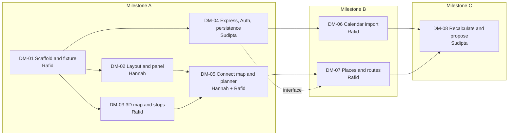

# Contributing to DayMap

DayMap turns a day's activities into a geographic map and a linked planner. This guide covers who owns what, the shared kickoff, the milestone plan, the starter issues, and how we work. Technical contracts are in [ARCHITECTURE.md](ARCHITECTURE.md).

**Status:** initial plan, September 2026. The repository contains documentation only. Directories, commands, endpoints, and environment variables mentioned here are targets for the starter issues, not working features.

## Contents

1. [Team and ownership](#1-team-and-ownership)
2. [Kickoff setup](#2-kickoff-setup)
3. [Roadmap](#3-roadmap)
4. [Starter issues](#4-starter-issues)
5. [Development workflow](#5-development-workflow)
6. [Working agreements](#6-working-agreements)

## 1. Team and ownership

| Person | Area | Owns | First deliverable | Reviewer |
| --- | --- | --- | --- | --- |
| Hannah | App layout and planner | `client/src/planner/`, `client/src/components/` | Floating event panel reading the shared sample plan | Rafid |
| Rafid | Map, external APIs, scaffold, shared frontend state | Root config, `client/src/app/`, `client/src/map/`, `server/src/integrations/` | Adelaide map with selectable stops; Google API setup and integration adapters | Hannah (UI), Sudipta (APIs) |
| Sudipta | Backend, Supabase, authentication, persistence, planning engine | Rest of `server/`, `supabase/migrations/` | Express health and sample-plan endpoints, first database migration | Rafid |

- **Ownership means coordinating, not working alone.** Agree with the owner before changing another area's component interface.
- **Shared configuration** (`package.json`, lockfile, `.nvmrc`, lint/format config, Vite config) is coordinated by Rafid, to avoid conflicting scaffolds and lockfiles.
- **Database migrations** are owned by Sudipta.
- **The shared contract and fixture** (`shared/`) belong to all three.

### External API integration split

- **Rafid** leads the external API integrations: Google Calendar, Places, Routes, and later weather. This is part of his primary responsibility, not later support. He owns provider requests and response normalisation.
- **Sudipta** leads the backend that exposes those integrations to the app: authenticated endpoints, secure token storage, database access, validation, and scheduling.
- Rafid and Sudipta agree on adapter inputs and outputs before implementing them.
- **Hannah** builds the login, Calendar connection, and integration error screens alongside the planner.

## 2. Kickoff setup

Do this together in one short session before splitting up. Leave with one runnable scaffold and one fictional sample plan.

| Task | Coordinator | Done when |
| --- | --- | --- |
| Repository access | Rafid | Hannah and Sudipta can clone and push feature branches from their own GitHub accounts |
| GitHub Project | Rafid | Board has Backlog, Ready, In progress, In review, and Done; every issue has an owner and a milestone |
| Runtime and package manager | Rafid | One Node LTS version pinned in `.nvmrc`; everyone uses npm and the committed lockfile |
| Scaffold and dev commands | Rafid, with Sudipta | React/Vite client and Express server start with one root command (DM-01) |
| Shared contract and fixture | All three | Stop fields, stable IDs, missing locations, timezone, and map/card selection agreed; one fictional Adelaide sample plan committed |
| Google Cloud project | Rafid | Maps JavaScript, Places, Routes, and Calendar APIs enabled as needed; billing/quota controls set; separate browser and server credentials |
| Google OAuth | Rafid + Sudipta | Consent screen, development test users, and exact local callback URLs configured; deployment callbacks documented once hosting is chosen |
| Supabase development project | Sudipta | Team access, Auth configuration, first migration, row-level access policies, and a test user ready |
| Environment templates | Rafid + Sudipta | Variable names and placeholders committed in `.env.example` files; real credentials shared privately |
| Visual conventions | Hannah | Spacing, colour, card dimensions, loading/error styles, and keyboard focus styles agreed |

**Decide at kickoff:** the MVP transport mode, the Node LTS version, and everyone's GitHub username for issue assignment. The other open technical decisions and their deadlines are listed in [ARCHITECTURE.md §12](ARCHITECTURE.md#12-open-decisions).

- Use one shared development Supabase project. Commit schema changes as migrations so nobody has to reproduce undocumented dashboard edits.
- Use fictional activities in the demo fixture. Connecting a personal calendar during frontend development is optional.
- Choose a static frontend host and a Node-capable backend host together before the connected demo. Record their origins in the setup instructions and register the exact OAuth redirects. Don't let hosting block Milestone A.

## 3. Roadmap

### Overview

| Milestone | Goal | Issues | Exit demo |
| --- | --- | --- | --- |
| **A.** Connected visual prototype | Map and planner working on the same sample data, with no login or Calendar | DM-01 to DM-05 | Selection and edits stay in sync across map and planner |
| **B.** Real events and journeys | Real Calendar events, place search, actual route geometry, persisted plans | DM-04 (persistence), DM-06, DM-07 | Import today's events, show real journeys, survive a page refresh |
| **C.** One adaptive planning flow | One recalculation proposal with Accept / Keep current plan | DM-08 | A conflict produces a proposal that changes nothing until accepted |



Two chains set the pace:

- **Map and journeys:** DM-01 → DM-02 and DM-03 → DM-05 → DM-07 → DM-08.
- **Persistence and Calendar:** DM-01 → DM-04 → DM-06 → DM-08.

The second chain depends on external setup (Supabase, Google OAuth), so that setup starts at kickoff. Frontend work continues against the shared fixture in the meantime.

### Milestone A: connected visual prototype

**Goal:** a working map and planner using the same sample data, with no login or Calendar access.

| Who | Work | Issue |
| --- | --- | --- |
| All three | Finalise the contract, scaffold, and sample data | DM-01 |
| Hannah | Layout and planner | DM-02 |
| Rafid | Map adapter and stop markers | DM-03 |
| Sudipta | Backend and Supabase foundation | DM-04 |
| Hannah + Rafid | Connect selection and editing; Sudipta checks contract compatibility | DM-05 |

**Demo:**

- Select an event card, and its marker highlights.
- Select a marker, and its card opens.
- Edit an activity, and both views update.
- Unlocated activities stay in the planner.
- Any sample route geometry is labelled as demo data.

**Timing:** merge and run this complete flow within roughly the first quarter of the hackathon. Don't wait until each area is visually finished.

### Milestone B: real events and journeys

**Goal:** real Calendar events, place search, actual route geometry, and persisted plans.

| Who | Work | Issue |
| --- | --- | --- |
| Sudipta | Finish authenticated plan persistence, secure token storage, and endpoint support for the integrations | DM-04, DM-06 |
| Rafid | Google Calendar authorisation and event import, pairing with Sudipta on session binding and server security | DM-06 |
| Rafid | Location search and actual route geometry, pairing with Sudipta on the server integration | DM-07 |
| Hannah | Login and connection states, location confirmation, travel times, error screens | UI for DM-06 and DM-07 |

**Demo:** connect a test calendar, import today's events, resolve one missing location, and show actual journeys between located stops. Refresh the page and recover the saved plan.

DM-07 can be built against the fixture while DM-06 is in progress.

### Milestone C: one adaptive planning flow

**Goal:** one recalculation proposal with Accept and Keep current plan.

| Who | Work | Issue |
| --- | --- | --- |
| Sudipta | Duration and buffer calculations, one recalculation proposal | DM-08 |
| Hannah | Proposal card with Accept and Keep current plan | UI for DM-08 |
| Rafid | Preview affected legs on the map; help finish the end-to-end demo | Map for DM-08 |

**Demo:** extend a library visit, show the resulting conflict with a fixed event, propose a valid change if one exists, and update both views only after the user accepts.

**Before judging:** walk through one complete story together on the actual demo laptop, including failed route and Calendar requests.

### After Milestone C

Everything in the later backlog ([ARCHITECTURE.md §1](ARCHITECTURE.md#not-in-the-mvp)) waits until all three milestones work.

### Risks

| Risk | Mitigation |
| --- | --- |
| Rafid owns four issues (DM-01, DM-03, DM-06, DM-07), so Milestone B hinges on him | Start Google Cloud and OAuth setup at kickoff; Sudipta pairs on the server side of DM-06 and DM-07 ([§1](#external-api-integration-split)); DM-07 can start on the fixture before DM-06 lands |
| Integration adapters and backend endpoints don't fit together | Rafid and Sudipta agree adapter inputs and outputs before implementing; the frontend keeps working against fixtures |
| 3D map is missing or slow at demo locations or on the demo laptop | Check coverage and performance early in DM-03; keep a 2D or retry fallback |
| Google OAuth setup delays Calendar import | Configure the consent screen and test users at kickoff; Milestone A and demo mode need no Calendar |
| Unexpected Google API costs | Billing and quota controls at kickoff; debounce searches and edits; bound retries |
| Areas built in isolation don't fit together | Merge the Milestone A flow early and keep PRs small, rather than polishing each area first |

## 4. Starter issues

### Using the board

- The drafts below are not existing GitHub issues. Create these eight first and keep later ideas in Backlog. Assign each to the person's actual GitHub account.
- Statuses: Backlog → Ready → In progress → In review → Done.
- Fields: Status, Assignee, Milestone, Priority. Area labels: `frontend`, `map`, `backend`, `integration`, `setup`.
- An issue is **Ready** when its dependencies are merged or a usable mock contract exists.
- Keep one main issue per person In progress.

### Summary

| ID | Title | Owner | Support | Milestone | Priority | Depends on |
| --- | --- | --- | --- | --- | --- | --- |
| [DM-01](#dm-01-scaffold-the-app-and-publish-the-shared-plan-fixture) | Scaffold the app and publish the shared plan fixture | Rafid | All three (contract) | A | P0 | None |
| [DM-02](#dm-02-build-the-map-page-layout-and-floating-event-panel) | Build the map-page layout and floating event panel | Hannah | | A | P0 | DM-01 |
| [DM-03](#dm-03-render-the-adelaide-3d-map-and-selectable-stops) | Render the Adelaide 3D map and selectable stops | Rafid | | A | P0 | DM-01, map credentials |
| [DM-04](#dm-04-set-up-express-supabase-auth-and-plan-persistence) | Set up Express, Supabase Auth, and plan persistence | Sudipta | | A (foundation), B (persistence) | P0 | DM-01, Supabase setup |
| [DM-05](#dm-05-connect-map-and-planner-into-one-usable-flow) | Connect map and planner into one usable flow | Hannah | Rafid (pair) | A | P0 | DM-02, DM-03 |
| [DM-06](#dm-06-connect-google-calendar-and-import-todays-events) | Connect Google Calendar and import today's events | Rafid | Sudipta (backend/security), Hannah (UI) | B | P1 | DM-04, OAuth setup |
| [DM-07](#dm-07-resolve-places-and-draw-actual-journeys) | Resolve places and draw actual journeys | Rafid | Sudipta (server), Hannah (UI) | B | P1 | DM-05, DM-04 integration interface |
| [DM-08](#dm-08-recalculate-the-remaining-day-and-offer-one-change) | Recalculate the remaining day and offer one change | Sudipta | Hannah (UI), Rafid (map) | C | P1 | DM-06, DM-07 |

### DM-01: Scaffold the app and publish the shared plan fixture

**Labels:** `setup`

**Scope**

- npm workspaces with a React/Vite client and an Express server, shared fixtures, lint/format configuration, and environment templates.
- A `PlanProvider` (React context + reducer) holding the accepted plan and the selected stop.
- Record the DM-01 decisions from [ARCHITECTURE.md §12](ARCHITECTURE.md#12-open-decisions) (CSS or Tailwind, linter/formatter, contract field names).

**Acceptance criteria**

- [ ] All three developers can start the app from a fresh clone.
- [ ] The frontend reads the shared fixture.
- [ ] Root `dev`, `build`, and `lint` scripts work and are documented in the README.
- [ ] Secrets and dependencies are ignored by Git.

### DM-02: Build the map-page layout and floating event panel

**Labels:** `frontend`

**Scope**

- Follow the sketch: full-screen map area, menu button, top location search area, and a compact right-side Events panel with its own event filter.
- Cards show explicit times, duration, location status, and fixed/flexible status.
- Add, edit, and remove flexible activities.

**Acceptance criteria**

- [ ] Works with fixture data.
- [ ] Has empty, loading, and error states.
- [ ] Cards can be selected with the keyboard.
- [ ] The panel collapses, and mobile uses a bottom sheet.
- [ ] Filtering cards does not remove stops from the plan.

### DM-03: Render the Adelaide 3D map and selectable stops

**Labels:** `map`

**Scope**

- Validate 3D coverage at the demo locations.
- Mount one persistent map instance, render pins, and implement stop selection.

**Acceptance criteria**

- [ ] Markers match the fixture coordinates.
- [ ] Selecting a marker updates the shared selection; selecting a card highlights its marker.
- [ ] Unlocated stops are left off the map.
- [ ] A clear fallback/error state exists if 3D fails.
- [ ] Map attribution remains visible.

### DM-04: Set up Express, Supabase Auth, and plan persistence

**Labels:** `backend`

**Scope**

- Health and sample-plan endpoints, session verification, the initial migration, and authenticated plan read/save endpoints ([ARCHITECTURE.md §6](ARCHITECTURE.md#6-backend-api)).

**Acceptance criteria**

- [ ] The fixture endpoint works without external services.
- [ ] Authenticated users can save and reload their plans.
- [ ] Another user cannot access them, and an access-isolation test proves it.
- [ ] Privileged credentials never reach the browser.
- [ ] Endpoint examples and error responses are documented for Hannah and Rafid.

### DM-05: Connect map and planner into one usable flow

**Labels:** `frontend`, `map`

**Scope**

- Connect both surfaces through the shared provider.
- Implement the place-popover-to-add-event interaction.
- Sudipta checks contract compatibility.

**Acceptance criteria**

- [ ] Selection works in both directions.
- [ ] Adding, editing, or removing a flexible activity updates both surfaces without resetting the map.
- [ ] Closing a popup does not delete data.
- [ ] No component keeps its own copy of the plan state.

### DM-06: Connect Google Calendar and import today's events

**Labels:** `integration`, `backend`

**Scope**

- Rafid: the Google OAuth/API adapter, primary-calendar import, and an event normaliser that returns DayMap stops.
- Sudipta: authenticated routes, session-bound callback state, encrypted token storage, and persistence.
- Read-only Calendar access throughout ([ARCHITECTURE.md §8](ARCHITECTURE.md#8-google-calendar-integration)).

**Acceptance criteria**

- [ ] Date boundaries use the user's timezone.
- [ ] Recurring occurrences import correctly.
- [ ] Repeating an import creates no duplicates.
- [ ] All-day, online, and missing-location events remain usable.
- [ ] Denied or expired access prompts reconnection.
- [ ] Import never changes Google Calendar.

### DM-07: Resolve places and draw actual journeys

**Labels:** `map`, `integration`

**Scope**

- Connect the top search to Places and confirm a result.
- Fetch routes between consecutive located stops, using the one agreed transport mode.
- Can be built on the fixture while DM-06 is in progress. Settle the route endpoint first ([ARCHITECTURE.md §12](ARCHITECTURE.md#12-open-decisions)).

**Acceptance criteria**

- [ ] Selected places provide coordinates.
- [ ] Legs follow the returned route geometry, not straight pin-to-pin lines.
- [ ] Departure times reflect activity durations.
- [ ] Route failures are visible.
- [ ] Stale responses cannot overwrite newer edits.

### DM-08: Recalculate the remaining day and offer one change

**Labels:** `backend`

**Scope**

- Calculate travel, visit durations, buffers, and fixed-event conflicts ([ARCHITECTURE.md §9](ARCHITECTURE.md#9-routing-and-scheduling)).
- Return a versioned proposed plan with an explanation.

**Acceptance criteria**

- [ ] Fixed commitments stay fixed.
- [ ] Impossible plans show a conflict.
- [ ] Accept updates the map, planner, and saved plan together.
- [ ] Keep current plan leaves all three unchanged.
- [ ] Outdated proposals are rejected.
- [ ] Focused tests cover these scheduling behaviours.

## 5. Development workflow

### Local setup

Once DM-01 is merged, the README's setup instructions are authoritative. The planned commands are:

```sh
git clone https://github.com/DayMapTeam/DayMap.git
cd DayMap
nvm install
nvm use
npm ci
cp client/.env.example client/.env.local
cp server/.env.example server/.env
npm run dev
```

**These commands do not work yet.** DM-01 adds root `dev`, `build`, and `lint` scripts. A `test` script comes with the first meaningful planning or access-control tests. Planned ports: client `5173`, server `3001`, with Vite proxying `/api` to the server.

### Branches and pull requests

- Work on feature branches such as `feat/planner-panel`, `feat/map-stops`, and `feat/calendar-import`.
- Open small pull requests linked to the board issue.
- Get one teammate's review before merging into `main`. Never commit directly to `main` or force-push it.
- Keep lockfile changes in the same PR as the dependency change, and coordinate shared configuration changes with Rafid.

### Pull request description

Copy this into each PR:

```md
## What changed
What users can now do. Closes #<issue>.

## How it was verified
Commands run and flow exercised. Screenshot for visible changes.

## Setup impact
New environment variables, migrations, or changed interfaces, or "None".
```

### Definition of done

- [ ] The relevant `build` and `lint` checks pass (and `test`, once it exists).
- [ ] The connected flow has been exercised in the running app.
- [ ] Scheduling constraints, Calendar imports, stale responses, and access isolation have focused tests where touched. Styling changes get a visual check instead of tests that mirror the implementation.
- [ ] Demo mode still works without login or Calendar credentials.
- [ ] Setup instructions and `.env.example` files are updated for any new variable, migration, or command.
- [ ] One teammate has reviewed the PR.

## 6. Working agreements

- When blocked, update the board and tell the team promptly. Keep working against shared fixtures where possible.
- Keep credentials, tokens, and real calendar exports out of commits, screenshots, issue bodies, and logs.
- Write JavaScript and JSX, adding JSDoc where it clarifies shared shapes. TypeScript is not part of the initial stack.
- Agree as a team before adding a framework or major dependency, changing the shared contract, or broadening the MVP.
- Keep demo mode working without login or Calendar credentials, and label simulated data and disruptions clearly.
